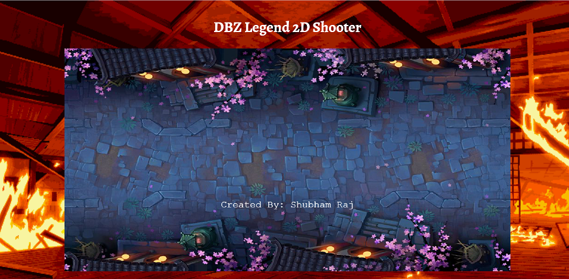
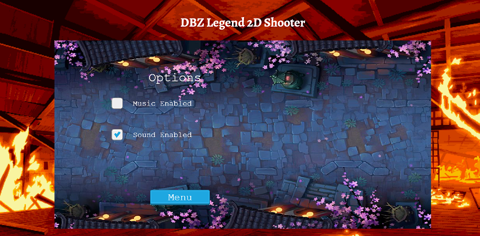
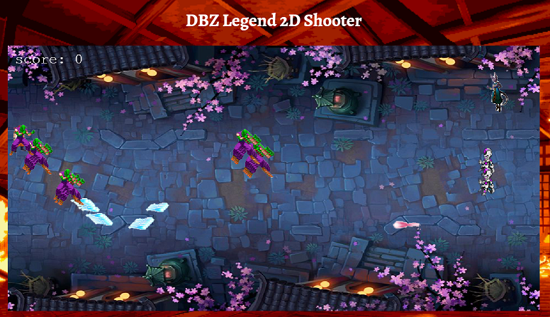
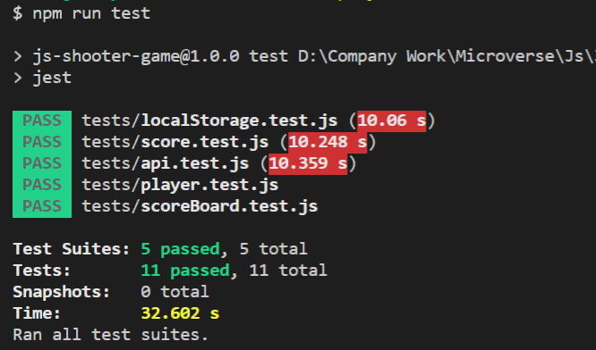

# DBZ Shooter 2D Game

[![Contributors][contributors-shield]][contributors-url]
[![Forks][forks-shield]][forks-url]
[![Stargazers][stars-shield]][stars-url]
[![Issues][issues-shield]][issues-url]

> DBZ is a 2D shooter game inspired by the Dragon Ball Z. The game is browser-based, designed on Phaser 3, and it uses a collection of amazing art by various designers (Please refer to the Acknowledgment section for more information). The objective of the game is to score the highest possible score while defeating the evil Vegeta and Beerus on your way. The main character Goku can call Picolo for help.

## Booting Screen
)

## Credit Screen


## Options Screen


## Play Ground Screen


## Top Score Screen


> For developing the game, I used JavaScript and Phaser 3 along with Express to host it on Heroku. I implemented an API provided by [Microverse](https://www.microverse.org/) to host the scoring database so that the highest scores will always be available for new users to try to beat! The API implementation required the use of promises and Async functions. I also used Classes and Modules to integrate everything in an industry-standard code style while implementing JavaScript, HTML, and CSS best practices.

## Live Version

[Live Version](https://suspicious-fermat-6c4f3b.netlify.app/)

### Controls

- A key => Move left.
- W key => Move up.
- D key => Move right.
- S key => Move down.
- J key => Confundus Charm.
- I key => Patronus Charm.

## Game development

| DAYS  |              OBJECTIVE               |                                                                                                                                                                                  DESCRIPTION                                                                                                                                                                                   |                                                                                                                                 OUTCOME                                                                                                                                  | STATUS  |
| :---- | :----------------------------------: | :----------------------------------------------------------------------------------------------------------------------------------------------------------------------------------------------------------------------------------------------------------------------------------------------------------------------------------------------------------------------------: | :----------------------------------------------------------------------------------------------------------------------------------------------------------------------------------------------------------------------------------------------------------------------: | :-----: |
| Day 1 |        Learn Phaser 3 module         |                                                                                                                 I coded along with three different tutorials, three different games to deeply understand the syntax and functionality of the Phaser 3 module.                                                                                                                  |                                                                                      I understood and learned the basics of the phaser library so that I could code my first game.                                                                                       | &#9745; |
| Day 2 |             Game Design              |              I designed the workflow for the next few days to be able to achieve all the requirements on time. I designed the basic structure and flow of the game. I gathered all the Sprites, the music theme, and images that I needed for the development of the project. I decided which scenes I would implement and created the template for the project.               |                                            By the end of the day, I had a functional template that used Webpack to start implementing the scenes for my game. I had the workflow for the next few days and the game concept.                                             | &#9745; |
| Day 3 |           Game Development           | I created the game itself using all the phaser tools and knowledge acquired during the last couple of days. I decided to let out some of the original ideas for the project since the creation of it was not trivial, and it required a lot of resourcefulness to be able to overcome all the blockers along the way. I implemented the scoring system using the provided API. |                                                       By the end of the day, I had a fully working game that ran on my local environment. I still had some styling to do, but in general, I had a working project.                                                       | &#9745; |
| Day 4 |   Testing, Styling, and Deployment   |                                                I added the final design details to the game, like background images and personalized logo. I refactored my code to be able to test it using Jest. I made the tests for the modules I created to add functionality to the Phaser module. Finally, I deployed the app to Heroku.                                                 | By the end of the day, I had a complete project that was accessible everywhere through Heroku hosting. The code was following industry standards for styling and modularity. I created tests for the methods I coded and implemented, and everything was up and running. | &#9745; |
| Day 5 | Documentation and request for review |                                                                    I added the README.md file, and made a final round of testing. I tested the code functionality to make sure it is working on Heroku as well as on the local environment. I used Jest for testing my code again, and request the review.                                                                     |                                                                              By the end of the day, I had completed the project with the requirements, and submitted a request for review..                                                                              |    🖋    |

## Built With

### Developing tools

- JavaScript
- Phaser 3
- HTML5
- CSS
- Webpack
- Github

### Testing Tools

- Jest
- Babel

### Styling and Lints

- Eslint
- Stylelint

### Deployment

- Express
- Netlify

## Getting Started

To get started with the app, please follow these steps:

- Navigate to the folder where you would like to save the game.

- Open your terminal by right-clicking, and opening the command line of your choice.

- Clone the repo by typing:

```
$ git clone https://github.com/shubham14p3/JS-Shooter-Game.git
```

- Access the newly created folder by typing:

```
$ cd JS-Shooter-Game
```

- Install the necessary dependencies:

```
npm install
```

- Bundle the resources and run the code locally:

```
$ npm run dev
```

- Open [http://localhost:8080/](http://localhost:8080/) on your browser.

Now you are all set to start fighting gainst the dark wizard's forces. Will yo be able to get at the top of the leaderboarrd? Enjoy!

### Testing

Tests were made to test the two modules added to make the Phaser library communicate to the API through the file api.js located in the path <em>./src/objects/</em>, and to provide it with the ability to create a Local Storage for the scoring system through the file localStorage.js in the same directory.



If you would like to run the tests yourself, please on the root directory run:

```
$ npm run test
```

### Prerequisites

- Node. If you do not have Node installed in your local machine, please refer to the [Official Documentation](https://nodejs.org/en/download/)
- Basic command line knowledge.

## Author

👤 **Shubham Raj**

- Github: [@ShubhamRaj](https://github.com/shubham14p3)
- Linkedin: [Shubham14p3](https://www.linkedin.com/in/shubham14p3/)

## Future Upgrades

- Make the special move for Goku- Kamahamehaa.
- Make the Beerus killable..
- Limit the speed at which the main character can fire to increase difficulty.
- Create more scenes and adding more players for each scene.

## 🤝 Contributing

Feel free to check the [issues page](https://github.com/shubham14p3/JS-Shooter-Game/issues).

## Show your support

Give a ⭐️ if you like this project!

## Acknowledgments

- Project requested by [Microverse Program](https://www.microverse.org/).
- Game based on the very successful DBZ franchise. All rights reserved to DBZ Team. The use of her property is solely for educational purposes.

<!-- MARKDOWN LINKS & IMAGES -->

[contributors-shield]: https://img.shields.io/github/contributors/shubham14p3/JS-Shooter-Game.svg?style=flat-square
[contributors-url]: https://github.com/shubham14p3/JS-Shooter-Game/graphs/contributors
[forks-shield]: https://img.shields.io/github/forks/shubham14p3/JS-Shooter-Game.svg?style=flat-square
[forks-url]: https://github.com/shubham14p3/JS-Shooter-Game/network/members
[stars-shield]: https://img.shields.io/github/stars/shubham14p3/JS-Shooter-Game.svg?style=flat-square
[stars-url]: https://github.com/shubham14p3/JS-Shooter-Game/stargazers
[issues-shield]: https://img.shields.io/github/issues/shubham14p3/JS-Shooter-Game.svg?style=flat-square
[issues-url]: https://github.com/shubham14p3/JS-Shooter-Game/issues
